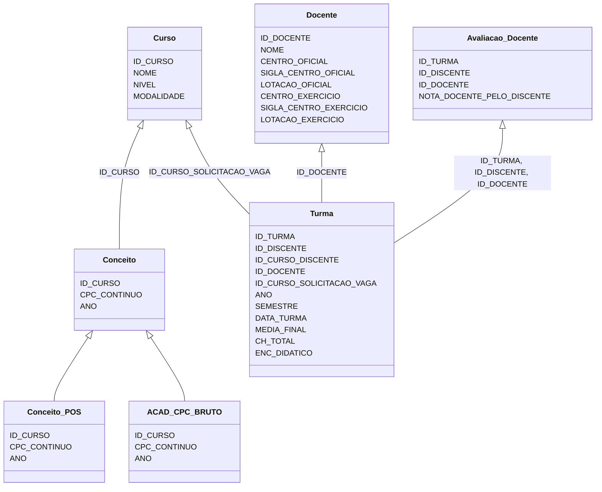

# Painéis

Painéis para cálculo do IGC dinâmico, com base nos dados disponíveis no banco de dados da UFSM.

## Caveats

* ID_DISCENTE: equivalente a ID_CURSO_ALUNO na tabela CURSOS_ALUNOS_ATZ
* ID_CURSO_DISCENTE: equivalente a ID_CURSO na tabela CURSOS_ALUNOS_ATZ
* ID_DOCENTE: mesma coisa que o ID_DOCENTE no banco bee (que por sua vez é o ID_CONTRATO_RH de GERAL_SERVIDORES_UFSM)

## Tabelas tertiárias

1. Não devem ser usadas em um relatório do Power BI;
2. Dão suporte a tabelas secundárias.

* **ACAD_CPC_BRUTO:** Dados do CPC, com COD_CURSO como o ID do curso. Uma linha por curso/por ano
* **Conceito_POS:** Dados de conceito CAPES, provenientes de uma coleta da Sucupira. Estão em tabelas SUCUPIRA_* no 
  banco de dados. Uma linha por curso/por ano. **Apenas** cursos que estão funcionando 
  (status EM FUNCIONAMENTO ou EM DESATIVACAO na plataforma Sucupira) **E** possuem conceitos CAPES (ou seja, cursos que 
  **não estão** em avaliação)
* Alunos: Uma linha por aluno.

## Tabelas secundárias

1. Não devem ser usadas em um relatório do Power BI;
2. Dão suporte a tabelas secundárias.

* Conceito: União de ACAD_CPC_BRUTO e Conceito_Pos. Uma linha por curso/por ano. ID_CURSO como chave primária
* Avaliacao_Docente: A nota que um discente deu para um docente quando aquele foi aluno deste em uma turma. Uma linha 
  por combinação de aluno/docente/turma. Nota entre 0 e 10.

## Tabelas principais

Podem e devem ser utilizadas em um relatório do Power BI.

* Docente: Relação de docentes. Uma linha por docente.
* Curso: Cursos como aparecem no banco bee. Possui ID_CURSO como chave primária. Uma linha por curso 
* Turma: Uma linha por aluno, por docente, por turma. Apenas alunos aprovados com nota, reprovados com nota, e 
  matriculados.

