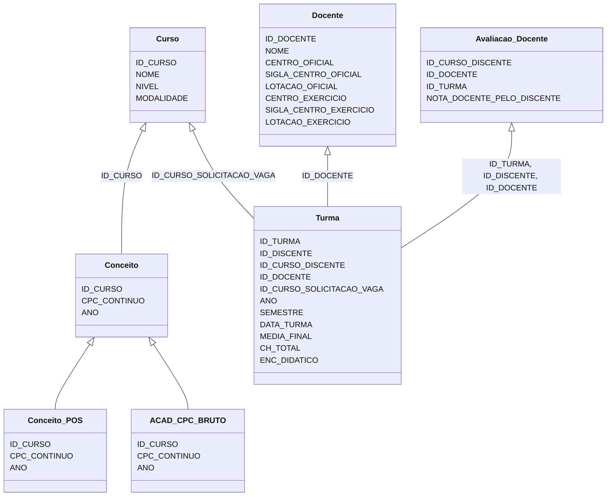

```mermaid
classDiagram
    Curso <|-- Conceito : ID_CURSO
    %% Turma <|-- Aluno : ID_DISCENTE
    Docente <|-- Turma : ID_DOCENTE
    %% Curso <|-- Aluno : ID_CURSO
    Curso <|-- Turma : ID_CURSO_SOLICITACAO_VAGA
    Conceito <|-- Conceito_POS 
    Conceito <|-- ACAD_CPC_BRUTO
    Avaliacao_Docente <|-- Turma  : ID_TURMA, ID_DISCENTE, ID_DOCENTE

    class Curso {
      ID_CURSO
      NOME
      NIVEL
      MODALIDADE
    }
    
    class ACAD_CPC_BRUTO {
        ID_CURSO
        CPC_CONTINUO
        ANO
    }

    class Conceito_POS {
        ID_CURSO
        CPC_CONTINUO
        ANO
    }

    class Conceito {
        ID_CURSO
        CPC_CONTINUO
        ANO
    }

    class Docente {
        ID_DOCENTE
        NOME
        CENTRO_OFICIAL
        SIGLA_CENTRO_OFICIAL
        LOTACAO_OFICIAL
        CENTRO_EXERCICIO
        SIGLA_CENTRO_EXERCICIO
        LOTACAO_EXERCICIO
    }

    %% class Aluno {
    %%     ID_DISCENTE
    %%     NOME_DISCENTE
    %%     ID_CURSO_DISCENTE
    %%     ANO_INGRESSO
    %%     ANO_EVASAO
    %% }

    class Avaliacao_Docente {
        ID_CURSO_DISCENTE
        ID_DOCENTE
        ID_TURMA
        NOTA_DOCENTE_PELO_DISCENTE
    }

    class Turma {
      ID_TURMA
      ID_DISCENTE
      ID_CURSO_DISCENTE
      ID_DOCENTE
      ID_CURSO_SOLICITACAO_VAGA
      ANO
      SEMESTRE
      DATA_TURMA
      MEDIA_FINAL
      CH_TOTAL
      ENC_DIDATICO
    }
```
