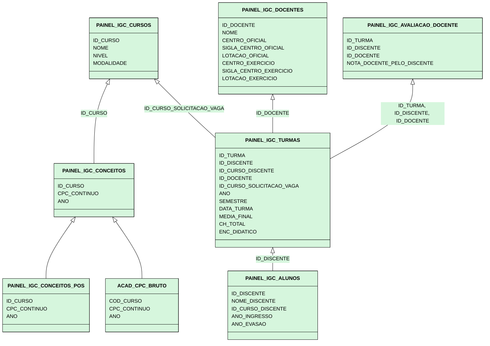

# Views

As views criadas e utilizadas para cálculo do IGC docente são descritas nesta seção. Algumas views são de suporte, sendo
utilizadas pelas views principais, e não devem constar em relatórios do Power BI.

## Caveats

* `ID_DISCENTE`: equivalente a `ID_CURSO_ALUNO` na tabela `CURSOS_ALUNOS_ATZ`
* `ID_CURSO_DISCENTE`: equivalente a `ID_CURSO` na tabela `CURSOS_ALUNOS_ATZ`
* `ID_DOCENTE`: idêntico a `ID_DOCENTE` no banco bee, que por sua vez é `ID_CONTRATO_RH` da tabela 
  `GERAL_SERVIDORES_UFSM`

<details>
<summary><h2>Tabelas tertiárias</h2></summary>

* (Tabela) **ACAD_CPC_BRUTO:** Dados do CPC, com COD_CURSO como o ID do curso. Uma linha por curso/por ano
* (View) **PAINEL_IGC_CONCEITOS_POS:** Dados de conceito CAPES, provenientes de uma coleta da Sucupira. Estão em tabelas 
  SUCUPIRA_* no banco de dados. Uma linha por curso/por ano. **Apenas** cursos que estão funcionando (status EM 
  FUNCIONAMENTO ou EM DESATIVACAO na plataforma Sucupira) **E** possuem conceitos CAPES (ou seja, cursos que 
  **não estão** em avaliação). Uma linha por curso, por ano.
* (View) **PAINEL_IGC_CONCEITOS_PREVIOS:** União do CPC Contínuo dos cursos de graduação (ACAD_CPC_BRUTO) e Conceito 
  Capes dos cursos de Pós-graduação (PAINEL_IGC_CONCEITOS_POS). Uma linha por curso, por ano.
* (View) **PAINEL_IGC_ALUNOS:** Uma view que seleciona e trata dados da tabela CURSOS_ALUNOS_ATZ. Uma linha por aluno 
  por curso matriculado.

<details>
<summary><h3>SQL</h3></summary>

#### PAINEL_IGC_CONCEITOS_POS

```sql
CREATE OR REPLACE VIEW PAINEL_IGC_CONCEITOS_POS AS
select *,
    CASE
        when POS.CONCEITO_CAPES = 3 then 4
        when POS.CONCEITO_CAPES = 4 then 4.5
        when POS.CONCEITO_CAPES = 5 then 5
        when POS.CONCEITO_CAPES = 6 then 5
        when POS.CONCEITO_CAPES = 7 then 5
    END AS CPC_CONTINUO
from (
    select sp.ID_PROGRAMA_SUCUPIRA, sp.NOME_PROGRAMA_SUCUPIRA,
        case
            when spi.CONCEITO_MESTRADO_ACADEMICO is not null then spi.CONCEITO_MESTRADO_ACADEMICO
            when spi.CONCEITO_DOUTORADO_ACADEMICO is not null then spi.CONCEITO_DOUTORADO_ACADEMICO
            when spi.CONCEITO_MESTRADO_PROFISSIONAL is not null then spi.CONCEITO_MESTRADO_PROFISSIONAL
            when spi.CONCEITO_DOUTORADO_PROFISSIONAL is not null then spi.CONCEITO_DOUTORADO_PROFISSIONAL
            ELSE NULL
        END AS CONCEITO_CAPES,
        spi.EM_AVALIACAO,
        spi.SITUACAO_PROGRAMA,
        spi.ANO ano_conceito
    from SUCUPIRA_PROGRAMAS sp
    inner join SUCUPIRA_PROGRAMAS_INDICES spi on sp.id_programa_sucupira = spi.id_programa_sucupira
    where spi.EM_AVALIACAO = 0 and spi.SITUACAO_PROGRAMA <> 'DESATIVADO'
) as pos;

comment on table PAINEL_IGC_CONCEITOS_POS is 'Não usar em relatório do Power BI - é usada apenas como suporte para outras views. Para mais informações, consulte https://github.com/COPLIN-UFSM/IGC';
```

#### PAINEL_IGC_CONCEITOS_PREVIOS

```sql
CREATE OR REPLACE VIEW PAINEL_IGC_CONCEITOS_PREVIOS as
select * from (
    select ac.ID_CURSO, ac.NOME_CURSO, acb.CPC_CONTINUO, acb.ANO ANO_CONCEITO
    from ACAD_CURSOS ac
    inner join ACAD_CPC_BRUTO acb on ac.COD_E_MEC = acb.COD_CURSO
    where cpc_continuo is not null
) union (
    select ac.ID_CURSO, ac.NOME_CURSO, picp.CPC_CONTINUO, picp.ANO_CONCEITO
    from ACAD_CURSOS ac
    inner join PAINEL_IGC_CONCEITOS_POS picp on ac.ID_PROGRAMA_SUCUPIRA = picp.ID_PROGRAMA_SUCUPIRA
    where CPC_CONTINUO is not null
);

comment on table PAINEL_IGC_CONCEITOS_PREVIOS is 'Não usar em relatório do Power BI - é usada apenas como suporte para outras views. Para mais informações, consulte https://github.com/COPLIN-UFSM/IGC';
```

#### PAINEL_IGC_ALUNOS

```sql
CREATE OR REPLACE VIEW PAINEL_IGC_ALUNOS as
SELECT
    CAA.ID_CURSO_ALUNO ID_DISCENTE,
    strip(CAA.NOME_ALUNO) NOME_DISCENTE,
    CAA.ID_CURSO ID_CURSO_DISCENTE,
    pic.ID_PROGRAMA_SUCUPIRA ID_PROGRAMA_DISCENTE,
    pic.NOME_PROGRAMA_SUCUPIRA NOME_PROGRAMA_DISCENTE,
    caa.ANO_INGRESSO, caa.ANO_EVASAO,
    pic.ID_NIVEL, pic.NOME_NIVEL, pic.ID_MODALIDADE, pic.NOME_MODALIDADE
FROM CURSOS_ALUNOS_ATZ CAA
INNER JOIN PAINEL_IGC_CURSOS pic on caa.id_curso = pic.ID_CURSO;

comment on table PAINEL_IGC_ALUNOS is 'Não usar em relatório do Power BI - é usada apenas como suporte para outras views. Para mais informações, consulte https://github.com/COPLIN-UFSM/IGC';
```

</details>

</details>

<details>
<summary><h2>Tabelas secundárias</h2></summary>

* (View) **PAINEL_IGC_CONCEITOS:** Apenas o conceito mais recente para cada curso (de graduação ou pós-graduação). Uma
  linha por curso.
* (View) **PAINEL_IGC_AVALIACAO_DOCENTE:** A média da nota que um discente deu para um docente quando aquele foi aluno 
  deste em uma turma. Uma linha por aluno/docente/turma. Notas entre 0 e 10.

<details>
<summary><h3>SQL</h3></summary>

#### PAINEL_IGC_CONCEITOS

```sql
CREATE OR REPLACE VIEW PAINEL_IGC_CONCEITOS as
select leftie.*,
    case
        when leftie.ANO_CONCEITO = rightie.ANO_MAIS_RECENTE then 1
        else 0
    end as mais_recente
from ((
    select
        ac.ID_CURSO, strip(ac.NOME_CURSO) NOME_CURSO,
        NULL ID_PROGRAMA_SUCUPIRA, NULL NOME_PROGRAMA_SUCUPIRA,
        NULL CONCEITO_CAPES_PROGRAMA_SUCUPIRA, acb.CPC_CONTINUO, acb.ANO ANO_CONCEITO
    from ACAD_CURSOS ac
    inner join ACAD_CPC_BRUTO acb on ac.COD_E_MEC = acb.COD_CURSO
    where cpc_continuo is not null
) union (
    select
        ac.ID_CURSO, strip(ac.NOME_CURSO) NOME_CURSO,
        picp.ID_PROGRAMA_SUCUPIRA, strip(picp.NOME_PROGRAMA_SUCUPIRA) NOME_PROGRAMA_SUCUPIRA,
        picp.CONCEITO_CAPES CONCEITO_CAPES_PROGRAMA_SUCUPIRA,
        picp.CPC_CONTINUO, picp.ANO_CONCEITO
    from ACAD_CURSOS ac
    inner join PAINEL_IGC_CONCEITOS_POS picp on ac.ID_PROGRAMA_SUCUPIRA = picp.ID_PROGRAMA_SUCUPIRA
    where CPC_CONTINUO is not null
)) as leftie inner join (
    select pp.ID_CURSO, MAX(pp.ANO_CONCEITO) ANO_MAIS_RECENTE
    from PAINEL_IGC_CONCEITOS_PREVIOS pp
    group by pp.ID_CURSO
) rightie on leftie.ID_CURSO = rightie.ID_CURSO;

comment on table PAINEL_IGC_CONCEITOS is 'Não usar em relatório do Power BI - é usada apenas como suporte para outras views. Para mais informações, consulte https://github.com/COPLIN-UFSM/IGC';
```

#### PAINEL_IGC_AVALIACAO_DOCENTE

```sql
CREATE OR REPLACE VIEW PAINEL_IGC_AVALIACAO_DOCENTE as
select
    ca.id_turma, caa.id_curso_aluno ID_DISCENTE, ID_DOCENTE, temp.NOTA_DOCENTE_PELO_DISCENTE
from (
    select ID_CURSO_ALUNO, ID_CURRICULO, round(avg(FLOAT(valor)/float(6)), 2) NOTA_DOCENTE_PELO_DISCENTE
    from AVALIACAO_ENSINO_APRENDIZAGEM_RESPOSTAS aear
    group by ID_CURSO_ALUNO, ID_CURRICULO
) AS TEMP
inner join CURRICULO_ALUNO ca on TEMP.ID_CURRICULO = ca.ID_CURRIC_ALUNO
inner join CURSOS_ALUNOS_ATZ caa on ca.ID_CURSO_ALUNO = caa.ID_CURSO_ALUNO
inner join TURMAS_VAGAS tv on ca.ID_TURMA = tv.ID_TURMA
inner join TURMAS_DOCENTES td on tv.ID_TURMA = td.ID_TURMA
where CA.SITUACAO_OCOR != 'E';

comment on table PAINEL_IGC_AVALIACAO_DOCENTE is 'Não usar em relatório do Power BI - é usada apenas como suporte para outras views. Para mais informações, consulte https://github.com/COPLIN-UFSM/IGC';
```

</details>

</details>

<details>
<summary><h2>Tabelas primárias</h2></summary>

* (View) **PAINEL_IGC_DOCENTES:** Docentes da instituição. Uma linha por docente.
* (View) **PAINEL_IGC_CURSOS:** Cursos da instituição. Uma linha por curso.
* (View) **PAINEL_IGC_TURMAS:** Relação de turmas ministradas. Uma linha por aluno, por docente, por turma. Caso dois ou
  mais docentes tenham lecionado na mesma turma, e considerando-se apenas um aluno, existirão nessa tabela 1 aluno * 1 
  turma * N docentes.

<details>
<summary><h3>SQL</h3></summary>

#### PAINEL_IGC_DOCENTES

```sql
CREATE OR REPLACE VIEW PAINEL_IGC_DOCENTES as
select ID_CONTRATO_RH ID_DOCENTE,
       STRIP(NOME_FUNCIONARIO) NOME_DOCENTE,
       STRIP(NC_OFICIAL.SIGLA_CENTRO) SIGLA_CENTRO_OFICIAL,
       NC_OFICIAL.ID_CENTRO ID_CENTRO_LOT_OFICIAL,
       STRIP(NC_OFICIAL.NOME_CENTRO) NOME_CENTRO_LOT_OFICIAL,
       ID_LOT_OFICIAL,
       STRIP(NU_OFICIAL.NOME_UNIDADE) NOME_LOT_OFICIAL,
       STRIP(NC_EXERCICIO.SIGLA_CENTRO) SIGLA_CENTRO_EXERCICIO,
       NC_EXERCICIO.ID_CENTRO ID_CENTRO_LOT_EXERCICIO,
       STRIP(NC_EXERCICIO.NOME_CENTRO) NOME_CENTRO_LOT_EXERCICIO,
       ID_LOT_EXERCICIO,
       STRIP(NU_EXERCICIO.NOME_UNIDADE) NOME_LOT_EXERCICIO
from GERAL_SERVIDORES_UFSM gsu
inner join NAV_UNIDADES NU_OFICIAL on ID_LOT_OFICIAL = NU_OFICIAL.ID_UNIDADE
inner join NAV_CENTROS NC_OFICIAL on NU_OFICIAL.ID_CENTRO = NC_OFICIAL.ID_CENTRO
inner join NAV_UNIDADES NU_EXERCICIO on ID_LOT_OFICIAL = NU_EXERCICIO.ID_UNIDADE
inner join NAV_CENTROS NC_EXERCICIO on NU_EXERCICIO.ID_CENTRO = NC_EXERCICIO.ID_CENTRO
where GRUPO_CARGO = 'D';

comment on table PAINEL_IGC_DOCENTES is 'Tabela de dimensão de docentes. Para mais informações, consulte https://github.com/COPLIN-UFSM/IGC';
```

#### PAINEL_IGC_CURSOS

```sql
CREATE OR REPLACE VIEW PAINEL_IGC_CURSOS AS
SELECT
    AC.ID_CURSO, STRIP(AC.NOME_CURSO) NOME_CURSO,
    strip(AC.COD_E_MEC) COD_E_MEC,
    sp.ID_PROGRAMA_SUCUPIRA,
    strip(sp.CODIGO_PROGRAMA_SUCUPIRA) CODIGO_PROGRAMA_SUCUPIRA, strip(sp.NOME_PROGRAMA_SUCUPIRA) NOME_PROGRAMA_SUCUPIRA,
    case
        when upper(strip(anc.DESCRICAO)) like 'PÓS-GRADUAÇÃO' then strip(sp.CODIGO_PROGRAMA_SUCUPIRA)
        else strip(AC.COD_E_MEC)
    end CODIGO_CURSO_UNIFICADO,
    AC.ID_MODALIDADE, STRIP(AM.DESCRICAO) NOME_MODALIDADE,
    AC.ID_NIVEL, STRIP(ANC.DESCRICAO) NOME_NIVEL,
    NC.ID_CENTRO, STRIP(NC.NOME_CENTRO) NOME_CENTRO
FROM ACAD_CURSOS AC
INNER JOIN ACAD_MODALIDADE AM ON AC.ID_MODALIDADE = AM.ID_MODALIDADE
INNER JOIN ACAD_NIVEL_CURSOS ANC ON AC.ID_NIVEL = ANC.ID_NIVEL
inner join NAV_CENTROS NC on AC.ID_CENTRO = NC.ID_CENTRO
LEFT join SUCUPIRA_PROGRAMAS sp on ac.ID_PROGRAMA_SUCUPIRA = sp.ID_PROGRAMA_SUCUPIRA
where ((AC.COD_E_MEC IS NOT NULL) OR (AC.ID_PROGRAMA_SUCUPIRA IS NOT NULL));

comment on table PAINEL_IGC_CURSOS is 'Tabela de dimensão de cursos. Para mais informações, consulte https://github.com/COPLIN-UFSM/IGC';
comment on column PAINEL_IGC_CURSOS.CODIGO_CURSO_UNIFICADO is 'É o código do programa de pós-graduação ou o código E-MEC (graduação), a depender do nível do curso.';
```

#### PAINEL_IGC_TURMAS

```sql
CREATE OR REPLACE VIEW PAINEL_IGC_TURMAS AS
SELECT
    CA.ID_TURMA,
    PIA.ID_DISCENTE,
    TD.ID_DOCENTE,
    PIA.ID_CURSO_DISCENTE,
    tv.ID_CURSO ID_CURSO_SOLICITACAO_TURMA,
    ca.ANO ANO_TURMA,
    CASE
        WHEN UPPER(te.DESCRICAO) LIKE '%1%SEMESTRE%' THEN CONCAT('01-01-', ca.ANO)
        WHEN UPPER(te.DESCRICAO) LIKE '%2%SEMESTRE%' THEN CONCAT('01-07-', ca.ANO)
        WHEN UPPER(te.DESCRICAO) LIKE '%1%TRIMESTRE%' THEN CONCAT('01-04-', CA.ANO)
        WHEN UPPER(te.DESCRICAO) LIKE '%2%TRIMESTRE%' THEN CONCAT('01-07-', CA.ANO)
        WHEN UPPER(te.DESCRICAO) LIKE '%3%TRIMESTRE%' THEN CONCAT('01-10-', CA.ANO)
        WHEN UPPER(te.DESCRICAO) LIKE '%ANUAL%' THEN CONCAT('01-01-', CA.ANO)
        ELSE NULL
    END AS DATA_TURMA,
    CASE
        WHEN UPPER(te.DESCRICAO) LIKE '%SEMESTRE%' THEN 'SEMESTRAL'
        WHEN UPPER(te.DESCRICAO) LIKE '%TRIMESTRE%' THEN 'TRIMESTRAL'
        WHEN UPPER(te.DESCRICAO) LIKE '%ANUAL%' THEN 'ANUAL'
        ELSE NULL
    END AS PERIODICIDADE,
    case
        when UPPER(PIA.NOME_NIVEL) = 'GRADUAÇÃO' THEN 1
        when UPPER(PIA.NOME_NIVEL) = 'PÓS-GRADUAÇÃO' and UPPER(PIA.NOME_MODALIDADE) = 'MESTRADO' then
            case
                when pic.CONCEITO_CAPES_PROGRAMA_SUCUPIRA = 3 THEN 1
                when pic.CONCEITO_CAPES_PROGRAMA_SUCUPIRA = 4 THEN 2
                when pic.CONCEITO_CAPES_PROGRAMA_SUCUPIRA >= 5 THEN 3
                ELSE NULL
            end
        when UPPER(PIA.NOME_NIVEL) = 'PÓS-GRADUAÇÃO' and UPPER(PIA.NOME_MODALIDADE) = 'DOUTORADO' then
            case
                when pic.CONCEITO_CAPES_PROGRAMA_SUCUPIRA = 3 THEN 1
                when pic.CONCEITO_CAPES_PROGRAMA_SUCUPIRA = 4 THEN 2
                when pic.CONCEITO_CAPES_PROGRAMA_SUCUPIRA = 5 THEN 3
                when pic.CONCEITO_CAPES_PROGRAMA_SUCUPIRA = 6 THEN 4
                when pic.CONCEITO_CAPES_PROGRAMA_SUCUPIRA = 7 THEN 5
                ELSE NULL
            end
        ELSE NULL
    end PESO_ALUNO,
    case
        when curso_discente.CODIGO_CURSO_UNIFICADO = curso_solicitacao.CODIGO_CURSO_UNIFICADO then 1
        else 0
    end CURSO_ALUNO_MESMO_CURSO_SOLICITACAO,
    ca.CH_TOTAL,
    float(ca.MEDIA_FINAL) MEDIA_FINAL,
    FLOAT(TD.ENC_DIDATICO) ENCARGO_DIDATICO_TURMA_DOCENTE,
    piad.NOTA_DOCENTE_PELO_DISCENTE,
    pic.ANO_CONCEITO, FLOAT(pic.CPC_CONTINUO) CPC_CONTINUO
FROM CURRICULO_ALUNO CA
inner join TAB_ESTRUTURADA te on COD_TABELA = PERIODO_TAB and te.ITEM_TABELA = ca.periodo_item
inner join TAB_ESTRUTURADA te2 on ca.SITUACAO_TAB = te2.COD_TABELA and ca.SITUACAO_ITEM = te2.ITEM_TABELA
INNER JOIN TURMAS_VAGAS TV ON CA.ID_TURMA = TV.ID_TURMA
INNER JOIN TURMAS_DOCENTES TD ON TV.ID_TURMA = TD.ID_TURMA
inner join PAINEL_IGC_ALUNOS pia on pia.ID_DISCENTE = CA.ID_CURSO_ALUNO
inner join PAINEL_IGC_CONCEITOS pic on pic.ID_CURSO = pia.ID_CURSO_DISCENTE
inner join painel_igc_cursos curso_discente on pia.ID_CURSO_DISCENTE = curso_discente.ID_CURSO
inner join PAINEL_IGC_CURSOS curso_solicitacao on tv.ID_CURSO = curso_solicitacao.ID_CURSO
    left join PAINEL_IGC_AVALIACAO_DOCENTE piad -- avaliações docentes pelo discente
    on ca.ID_TURMA = piad.ID_TURMA and
       piad.ID_DOCENTE = td.ID_DOCENTE and
       ca.ID_CURSO_ALUNO = piad.id_discente
WHERE
    (ca.SITUACAO_OCOR != 'E') and (ca.ID_TURMA is not null) and
    (ca.ANO >= pic.ANO_CONCEITO) and (pic.MAIS_RECENTE = 1) and
    (pic.ANO_CONCEITO is not null) and (pic.CPC_CONTINUO is not null) and
    (upper(te2.ITEM_TABELA) in (1, 2, 10));

comment on table PAINEL_IGC_TURMAS is 'Tabela de fatos de turmas. Para mais informações, consulte https://github.com/COPLIN-UFSM/IGC';
```

</details>

</details>

<details>
<summary><h2>Diagrama entidade-relacionamento das tabelas e views</h2></summary>


</details>

